# Database Design — Disaster Management System

This document describes the database design of the **Disaster Management System** — the persisted state that backs every citizen report, drone permit, officer dispatch, AI-processed insight, and admin action. The database is the system's **authoritative system of record**: every state that must survive a restart, be auditable, or be queryable lives here. High-frequency, ephemeral state (live drone GPS) is deliberately offloaded to Firebase Realtime Database as a sidecar; only periodic snapshots are synced back into PostgreSQL for durability.

The schema is defined through **SQLAlchemy 2.0 declarative ORM models** under [app/models/](../app/models/) and materialized into **PostgreSQL** via `Base.metadata.create_all(engine)` on FastAPI lifespan startup ([main.py](../app/main.py)). Integrity rules — foreign keys, cascade rules, `CheckConstraint`s on enum columns — are enforced at the storage layer so that invalid state is rejected by the database even if a bug slips past the application layer.

---

## 3.6.6 Database Design

The database is decomposed into **five domain groups**, each owning a cohesive set of tables:

| # | Domain | Tables | Purpose |
|---|---|---|---|
| 1 | **Identity & Session** | `user`, `otp`, `user_session`, `organization_code` | Who the caller is, how they were verified, and how long their session is valid |
| 2 | **Disaster Reporting** | `disaster_reports`, `disaster_report_images`, `disaster_report_status_history`, `drone_deployments` | Citizen incident reports, their media, their audit trail, and linked drone missions |
| 3 | **Drone Permits** | `drone_permit` | Digitized Nepal drone permit workflow — drone specs + operator identity + address hierarchy + documents + officer review |
| 4 | **Disaster Intelligence (Reddit NLP)** | `disaster_post`, `disaster_insight`, `disaster_stats` | Raw Reddit posts → NLP-classified insights → dashboard aggregates |
| 5 | **Video Analysis (CV)** | `video_analysis`, `frame_analysis`, `video_statistics` | Uploaded video metadata → per-frame YOLO results → overall statistics |

**Fifteen tables** in total. Three things characterize the design:

1. **Geospatial precision** — coordinates use `DECIMAL(10,8)` for latitude and `DECIMAL(11,8)` for longitude to avoid the floating-point drift that would affect marker placement and radius calculations.
2. **Defense-in-depth integrity** — enum validity is enforced at *two* layers: Pydantic schemas before the write and SQL `CheckConstraint`s at commit time. Either layer alone rejects invalid values; together they catch bugs that bypass one of them.
3. **Immutable audit trails** — every status change on a disaster report is appended (never updated) to `disaster_report_status_history`, preserving the complete decision trail for legal and operational accountability.

---

### 3.6.6.1 Entity Relationship Diagram

The Entity Relationship Diagram below shows the complete schema. Keys are marked `PK` (primary), `FK` (foreign), and `UK` (unique). Cardinalities follow crow's-foot conventions: `||--o{` = one-to-many, `||--||` = one-to-one, `||--o|` = one-to-zero-or-one. Cascade-delete edges are called out in section 3.6.6.3.

```mermaid
erDiagram
    USER ||--o{ OTP : "verifies via"
    USER ||--o{ USER_SESSION : "holds"
    USER ||--o{ DISASTER_REPORTS : "reports (user_id)"
    USER ||--o{ DISASTER_REPORTS : "assigned_to (assigned_officer_id)"
    USER ||--o{ DISASTER_REPORT_STATUS_HISTORY : "changed_by"
    USER ||--o{ DRONE_DEPLOYMENTS : "deployed_by"
    USER ||--o{ DRONE_PERMIT : "submits"
    USER ||--o{ VIDEO_ANALYSIS : "uploads"

    DISASTER_REPORTS ||--o{ DISASTER_REPORT_IMAGES : "has"
    DISASTER_REPORTS ||--o{ DISASTER_REPORT_STATUS_HISTORY : "audits"
    DISASTER_REPORTS ||--o{ DRONE_DEPLOYMENTS : "dispatches"

    DISASTER_POST ||--|| DISASTER_INSIGHT : "classified_as"

    VIDEO_ANALYSIS ||--o{ FRAME_ANALYSIS : "has frames"
    VIDEO_ANALYSIS ||--o| VIDEO_STATISTICS : "summarized_by"

    USER {
        int id PK
        string email UK
        string google_id UK
        string name
        enum role "citizen|officer|admin"
        boolean is_verified
        boolean is_active
        string profile_picture
        string phone
        string district
        string organization_code
        datetime created_at
        datetime updated_at
    }

    OTP {
        int id PK
        string email
        string otp_code
        int attempts
        boolean is_used
        datetime expires_at
        datetime created_at
    }

    USER_SESSION {
        int id PK
        string session_id UK
        int user_id FK
        boolean is_active
        datetime created_at
        datetime expires_at
        datetime last_activity
    }

    ORGANIZATION_CODE {
        int id PK
        string code UK
        string name
        string description
        boolean is_active
        int max_uses
        int current_uses
        int created_by
        datetime expires_at
        datetime created_at
    }

    DISASTER_REPORTS {
        int id PK
        int user_id FK
        int assigned_officer_id FK
        string reporter_name
        string reporter_contact
        string disaster_type
        string severity "CHECK LOW|MEDIUM|HIGH|CRITICAL"
        text description
        decimal latitude "DECIMAL(10,8)"
        decimal longitude "DECIMAL(11,8)"
        decimal location_accuracy
        text address
        string status "CHECK PENDING|REVIEWING|DISPATCHED|RESOLVED|REJECTED"
        int priority
        datetime created_at
        datetime updated_at
        datetime resolved_at
        datetime assigned_at
        text officer_notes
        text response_notes
    }

    DISASTER_REPORT_IMAGES {
        int id PK
        int report_id FK
        string image_path
        text image_url
        text thumbnail_url
        int file_size
        string mime_type
        int width
        int height
        datetime uploaded_at
        int display_order
    }

    DISASTER_REPORT_STATUS_HISTORY {
        int id PK
        int report_id FK
        int changed_by_user_id FK
        string previous_status
        string new_status
        string changed_by_name
        string changed_by_role
        text change_notes
        datetime changed_at
    }

    DRONE_DEPLOYMENTS {
        int id PK
        int report_id FK
        int deployed_by_officer_id FK
        string drone_id
        string drone_name
        datetime deployed_at
        string mission_status "CHECK DEPLOYED|EN_ROUTE|ON_SITE|RETURNING|COMPLETED|ABORTED"
        decimal last_known_latitude "DECIMAL(10,8)"
        decimal last_known_longitude "DECIMAL(11,8)"
        datetime last_sync_at
        datetime arrived_at
        datetime completed_at
        text mission_notes
        decimal distance_traveled
        int flight_duration
    }

    DRONE_PERMIT {
        int id PK
        int user_id FK
        string user_email
        string manufacturer
        string model
        string serial_number
        int manufactured_year
        string drone_type
        float max_payload
        string color
        string retailer_name
        string purpose_letter
        string purchase_bill
        string drone_image
        string citizenship_doc
        enum registration_type "individual|company"
        string full_name
        string citizenship_passport_no
        datetime date_of_birth
        string phone_number
        string email_address
        string username
        string country
        string province
        string district
        string municipality
        string ward_no
        boolean agrees_to_rules
        enum status "pending|approved|rejected"
        int reviewed_by_officer_id
        string officer_name
        string officer_designation
        string officer_organization
        string officer_email
        text review_remarks
        datetime reviewed_at
        datetime created_at
        datetime updated_at
    }

    DISASTER_POST {
        string id PK "Reddit post ID"
        text title
        text text
        datetime timestamp
        string location
        string source_subreddit
        int score
        int num_comments
        int created_utc
        string url
        datetime created_at
    }

    DISASTER_INSIGHT {
        int id PK
        string post_id FK,UK
        string disaster_type
        int severity_score "1-10"
        float sentiment "-1..+1"
        string location
        string date_time
        string request_offer
        text trending_keywords
        string urgency_level "low|medium|high|critical"
        float confidence_score
        string affected_population
        string damage_estimate
        datetime created_at
    }

    DISASTER_STATS {
        int id PK
        datetime timestamp
        int total_incidents
        int urgent_incidents
        float avg_sentiment
        string top_disaster_type
        string top_location
        int hourly_count
    }

    VIDEO_ANALYSIS {
        int id PK
        int user_id FK
        string original_filename
        string original_filepath
        float original_size_mb
        string processed_filepath
        string detection_output_path
        string segmentation_output_path
        float video_duration_seconds
        int total_frames
        int fps
        string resolution
        string processing_status "uploading|processing|completed|failed"
        int processing_progress "0-100"
        text error_message
        float overall_severity_score
        string risk_level "low|medium|high|critical"
        datetime upload_timestamp
        datetime processing_started_at
        datetime processing_completed_at
    }

    FRAME_ANALYSIS {
        int id PK
        int video_id FK
        int frame_number
        float timestamp_seconds
        json detections
        float detection_confidence
        json detection_boxes
        json segmentation
        float segmentation_confidence
        json segmentation_masks
        float severity_score
        int total_objects
        float affected_area_percent
        datetime created_at
    }

    VIDEO_STATISTICS {
        int id PK
        int video_id FK,UK
        json total_detections
        float avg_detection_confidence
        float max_detection_confidence
        float avg_affected_area
        float max_affected_area
        float avg_segmentation_confidence
        float max_segmentation_confidence
        json segmentation_summary
        float avg_severity_score
        float max_severity_score
        int peak_severity_frame
        float peak_severity_timestamp
        json risk_level_distribution
        datetime created_at
    }
```



The diagram deliberately omits the `disaster_stats`, `disaster_post`, and `organization_code` edges because those are standalone / lookup-style tables — `disaster_stats` is a rolling aggregate with no FKs, `organization_code` is a static lookup validated at registration, and `disaster_post` is linked to `disaster_insight` through a unique 1:1 relationship.

---

### 3.6.6.2 Major Entities and Relationships

This section walks through each of the 15 tables, specifying its purpose, key columns, relationships to other entities, and typical access patterns.

#### 3.6.6.2.1 Identity and Session Domain

**`user`** — the central identity table, referenced by nearly every other table in the schema.

- **Purpose**: stores every authenticated user of the platform, regardless of role.
- **Key columns**:
  - `id` (PK, integer, autoincrement)
  - `email` (unique, not null) — the Google account email; doubles as the login identifier.
  - `google_id` (unique, not null) — the Google OAuth subject identifier, immutable per user.
  - `role` (enum: `citizen` | `officer` | `admin`) — the single source of truth for RBAC decisions.
  - `is_verified` (boolean) — flipped to true only after successful OTP verification.
  - `is_active` (boolean) — soft-delete flag; admins toggle this via `DELETE /api/v1/users/delete/{id}`.
  - `organization_code` — persisted at registration for officers so their agency affiliation survives auditing.
  - `phone`, `district` — optional profile fields; `phone` is required before a user can be targeted by SMS broadcasts.
- **Relationships**:
  - 1:N to `otp` via `email` (unindexed logical link — not a hard FK because OTP rows predate user verification).
  - 1:N to `user_session` (`user_session.user_id`).
  - 1:N to `disaster_reports` twice: once as `user_id` (reporter) and once as `assigned_officer_id` (dispatcher). The dual FK is what lets one user play both roles over time.
  - 1:N to `disaster_report_status_history.changed_by_user_id`, `drone_deployments.deployed_by_officer_id`, `drone_permit.user_id`, `video_analysis.user_id`.
- **Access patterns**: lookup by email (login), by id (internal FK joins), filtered by role + is_active (admin user management).

**`otp`** — single-use email verification codes.

- **Purpose**: stores the 6-digit OTP issued during registration and password-less re-login.
- **Key columns**: `email` (indexed, not a hard FK), `otp_code` (the code string), `attempts` (0–3 cap), `is_used` (consumed on success), `expires_at` (UTC 10 min from creation).
- **Relationships**: logical 1:N with `user` via `email`. No hard FK because OTP precedes user verification.
- **Lifecycle**: generated on `POST /api/v1/auth/register` or `/resend-otp`, consumed on `/verify-otp`, left as-is for audit after expiry.

**`user_session`** — server-side sessions that power the cookie-based auth path.

- **Purpose**: stores active sessions so the backend can validate cookies independent of JWT.
- **Key columns**: `session_id` (unique, cryptographically random), `user_id` (FK to `user.id`), `expires_at`, `last_activity`, `is_active`.
- **Relationships**: N:1 to `user` with back-reference `sessions`.
- **Behavior**: sliding-window expiry — `last_activity` is refreshed on every authenticated request. `destroy_all_user_sessions(user_id)` invalidates every session for a user, forcing global logout.

**`organization_code`** — valid officer agency codes.

- **Purpose**: stores the codes officers must present at registration (NDRF, Fire Dept, Police). The primary codes live in `.env`, but this table allows admin-issued ad-hoc codes with usage caps and expiry.
- **Key columns**: `code` (unique), `name`, `is_active`, `max_uses` / `current_uses`, `expires_at`.
- **Helpers**: `is_expired`, `is_usable` properties validate codes against time and usage ceilings in one place.

#### 3.6.6.2.2 Disaster Reporting Domain

**`disaster_reports`** — the most operationally important table in the system.

- **Purpose**: stores every citizen-submitted incident report.
- **Key columns**:
  - `user_id` (FK → `user.id`, `ON DELETE CASCADE`) — nullable because anonymous reports are supported.
  - `assigned_officer_id` (FK → `user.id`, `ON DELETE SET NULL`) — preserves the report if the officer leaves the system.
  - `disaster_type` (indexed) — lowercase whitelist: `fire`, `flood`, `earthquake`, `landslide`, `storm`, `other`.
  - `severity` (indexed, `CheckConstraint`: `LOW | MEDIUM | HIGH | CRITICAL`) — drives marker color on the officer map.
  - `status` (indexed, `CheckConstraint`: `PENDING | REVIEWING | DISPATCHED | RESOLVED | REJECTED`) — the state of the report in the triage FSM.
  - `latitude DECIMAL(10,8)`, `longitude DECIMAL(11,8)` — exact geospatial precision.
  - `priority` (integer) — computed at submission from severity + disaster_type for queue ordering.
  - Notes fields: `officer_notes`, `response_notes` — free-text from the assigned officer.
  - `assigned_at`, `resolved_at` — SLA-critical timestamps.
- **Relationships**:
  - N:1 to `user` twice (reporter + assigned officer).
  - 1:N cascade-delete to `disaster_report_images`, `disaster_report_status_history`, `drone_deployments` — deleting a report removes everything attached to it.
- **Indexing**: all three hot query paths (`status`, `severity`, `disaster_type`, `created_at`) are individually indexed for fast filtering on the Command Center map.

**`disaster_report_images`** — media attached to a report.

- **Purpose**: stores paths + metadata for photos/videos uploaded alongside a report.
- **Key columns**: `report_id` (FK, cascade delete), `image_path`, `image_url`, `thumbnail_url`, `mime_type`, `file_size`, `width`, `height`, `display_order`.
- **Storage model**: the actual binary media lives on the local filesystem under `uploads/disaster_images/` with timestamp-prefixed filenames; only paths and metadata are in the database. This decouples DB size from media volume.
- **Size limits**: images ≤ 10 MB (JPEG/PNG/WebP), videos ≤ 50 MB (MP4/WebM/MOV/AVI) — enforced at the endpoint layer.

**`disaster_report_status_history`** — the append-only audit log.

- **Purpose**: every status change on a `DisasterReport` produces exactly one row here. The table is treated as write-once — no row is ever updated or deleted.
- **Key columns**: `report_id` (FK, cascade delete), `previous_status`, `new_status`, `changed_by_user_id` (FK, `ON DELETE SET NULL`), `changed_by_name`, `changed_by_role`, `change_notes`, `changed_at`.
- **Why the redundancy**: `changed_by_name` and `changed_by_role` are denormalized snapshots — if the user is later deleted or their role changes, the historical record still shows *who made the decision at the time*.
- **Operational value**: disaster response is legally accountable; this table is the evidence that every status transition was made by an authorized officer at a known timestamp.

**`drone_deployments`** — the link between a disaster report and a dispatched drone.

- **Purpose**: records each drone mission, links it to a report, and stores the latest Firebase-synced position.
- **Key columns**: `report_id` (FK, cascade delete), `drone_id`, `drone_name`, `deployed_by_officer_id` (FK, `ON DELETE SET NULL`), `mission_status` (`CheckConstraint`: `DEPLOYED | EN_ROUTE | ON_SITE | RETURNING | COMPLETED | ABORTED`), `last_known_latitude` / `longitude` / `last_sync_at`, `arrived_at`, `completed_at`, `distance_traveled`, `flight_duration`.
- **Relationship with Firebase**: the live telemetry stream lives in Firebase RTDB; the backend periodically reads the latest GPS and syncs it into `last_known_*` columns. This gives Postgres a durable snapshot without per-GPS-update writes.
- **Metrics**: `distance_traveled` (DECIMAL meters) and `flight_duration` (integer seconds) are computed at mission end for post-incident analytics.

#### 3.6.6.2.3 Drone Permit Domain

**`drone_permit`** — the largest single table in the schema (30+ columns), modelling Nepal's paper drone-permit form.

- **Purpose**: digitize the legally-mandated permit process so officers can review applications without physical paperwork.
- **Column groups**:
  - **User reference**: `user_id` (FK), `user_email` — denormalized email for faster reviewer queries.
  - **Drone technical specs**: `manufacturer`, `model`, `serial_number`, `manufactured_year`, `drone_type`, `max_payload` (float kg), `color`, `retailer_name`.
  - **Documents** (filesystem paths, stored under `uploads/permits/{user_id}/` with timestamp prefixes): `purpose_letter` (PDF), `purchase_bill` (PDF), `drone_image` (image), `citizenship_doc` (PDF).
  - **Operator identity**: `registration_type` (enum: `individual` | `company`), `full_name`, `citizenship_passport_no`, `date_of_birth`, `phone_number`, `email_address`, `username`.
  - **Nepal address hierarchy**: `country`, `province`, `district`, `municipality`, `ward_no`. This ordered structure mirrors Nepal's official administrative divisions.
  - **Agreement**: `agrees_to_rules` (boolean, enforced true at submission).
  - **Status + officer review**: `status` (enum: `pending` | `approved` | `rejected`), `reviewed_by_officer_id`, `officer_name`, `officer_designation`, `officer_organization`, `officer_email`, `review_remarks`, `reviewed_at`.
- **Design note**: the reviewer fields are denormalized snapshots (name, designation, organization, email) rather than strict FK joins because the permit must remain a self-contained legal document even if the officer later changes role or leaves the system.
- **Relationships**: N:1 to `user` (`drone_permits` back-reference). `reviewed_by_officer_id` is stored as a plain integer (not a hard FK) to allow the permit to outlive officer deletions.

#### 3.6.6.2.4 Disaster Intelligence Domain (Reddit NLP)

**`disaster_post`** — raw Reddit posts scraped from 43 subreddits.

- **Purpose**: store unmodified Reddit content for later NLP processing and provenance tracking.
- **Primary key**: `id` is a **string** (Reddit post ID), not an auto-integer — this makes deduplication trivial (the same post cannot be inserted twice).
- **Key columns**: `title`, `text`, `timestamp`, `location` (unprocessed raw), `source_subreddit`, `score`, `num_comments`, `created_utc`, `url`.

**`disaster_insight`** — NLP-processed output, one row per post.

- **Purpose**: stores the classification + sentiment + urgency + extracted entities produced by [nlp_processor.py](../app/services/nlp_processor.py).
- **Key columns**: `post_id` (FK → `disaster_post.id`, **unique** — enforces 1:1), `disaster_type`, `severity_score` (1–10 integer), `sentiment` (−1..+1 float), `location` (extracted via spaCy NER), `urgency_level` (low/medium/high/critical), `trending_keywords`, `affected_population`, `damage_estimate`, `confidence_score`.
- **Relationship**: `disaster_post` ||--|| `disaster_insight` — the `UNIQUE` constraint on `post_id` is what turns a generic 1:N FK into a 1:1 relationship.
- **Indexes**: `disaster_type`, `severity_score`, `location`, `urgency_level` — all four are common filter dimensions on the dashboards.

**`disaster_stats`** — rolling aggregates for dashboard widgets.

- **Purpose**: precompute hot dashboard numbers so the UI doesn't re-aggregate on every page load.
- **Key columns**: `total_incidents`, `urgent_incidents`, `avg_sentiment`, `top_disaster_type`, `top_location`, `hourly_count`, `timestamp`.
- **No FKs**: this is a write-only aggregation table refreshed by the background task — it's intentionally decoupled from the source tables for read performance.

#### 3.6.6.2.5 Video Analysis Domain (Computer Vision)

**`video_analysis`** — one row per uploaded video.

- **Purpose**: track video uploads through the YOLOv8 processing pipeline.
- **Key columns**: `user_id` (FK), file paths (`original_filepath`, `processed_filepath`, `detection_output_path`, `segmentation_output_path`), metadata (`video_duration_seconds`, `total_frames`, `fps`, `resolution`), processing state (`processing_status`: `uploading | processing | completed | failed`, `processing_progress` 0–100, `error_message`), analysis summary (`overall_severity_score`, `risk_level`).
- **Lifecycle timestamps**: `upload_timestamp`, `processing_started_at`, `processing_completed_at` — allow the frontend to show duration and throughput.

**`frame_analysis`** — one row per analyzed frame.

- **Purpose**: per-frame YOLO results with rich JSON payloads.
- **Key columns**: `video_id` (FK), `frame_number`, `timestamp_seconds`, `detections` (JSON: `{"fire": 3, "person": 5, ...}`), `detection_boxes` (JSON: bounding box coords), `segmentation` (JSON: area percentages), `segmentation_masks` (JSON), `severity_score`, `total_objects`, `affected_area_percent`.
- **Storage note**: JSON columns let the schema stay stable as YOLO detection classes change; the application parses the JSON to render per-frame overlays.

**`video_statistics`** — one row per video, 1:1 with `video_analysis`.

- **Purpose**: rolled-up aggregates computed at processing completion.
- **Key columns**: `video_id` (FK, **unique** — enforces 1:1), `total_detections` (JSON sum across all frames), confidence averages/maxes, affected area averages/maxes, `avg_severity_score`, `max_severity_score`, `peak_severity_frame`, `peak_severity_timestamp`, `risk_level_distribution` (JSON: `{"low": 120, "medium": 450, ...}`).

#### 3.6.6.2.6 Relationship Summary Table

| From | To | Cardinality | On Delete | FK Name |
|---|---|---|---|---|
| `disaster_reports.user_id` | `user.id` | N:1 | `CASCADE` | reporter |
| `disaster_reports.assigned_officer_id` | `user.id` | N:1 | `SET NULL` | assigned officer |
| `disaster_report_images.report_id` | `disaster_reports.id` | N:1 | `CASCADE` | — |
| `disaster_report_status_history.report_id` | `disaster_reports.id` | N:1 | `CASCADE` | — |
| `disaster_report_status_history.changed_by_user_id` | `user.id` | N:1 | `SET NULL` | — |
| `drone_deployments.report_id` | `disaster_reports.id` | N:1 | `CASCADE` | — |
| `drone_deployments.deployed_by_officer_id` | `user.id` | N:1 | `SET NULL` | — |
| `drone_permit.user_id` | `user.id` | N:1 | — | `drone_permit_user_id_fkey` |
| `user_session.user_id` | `user.id` | N:1 | — | — |
| `disaster_insight.post_id` | `disaster_post.id` | 1:1 (UNIQUE) | — | — |
| `video_analysis.user_id` | `user.id` | N:1 | — | — |
| `frame_analysis.video_id` | `video_analysis.id` | N:1 | — | — |
| `video_statistics.video_id` | `video_analysis.id` | 1:1 (UNIQUE) | — | — |

---

### 3.6.6.3 Constraints and Data Integrity Rules

The database enforces integrity through six distinct mechanisms, layered so that no single bug can corrupt the state of record. Every rule below is enforced *at commit time* by PostgreSQL itself — they are not merely application conventions.

#### 3.6.6.3.1 Primary Key & Uniqueness Constraints

Every table has an integer autoincrement `id` (except `disaster_post`, which uses the Reddit post ID as a natural string PK to deduplicate scraped posts).

Additional uniqueness guarantees:

| Table | Column | Rationale |
|---|---|---|
| `user` | `email` | One account per email; also the login identifier |
| `user` | `google_id` | One account per Google subject ID; prevents account duplication via email alias changes |
| `user_session` | `session_id` | Session cookies must be globally unique |
| `organization_code` | `code` | Lookup by code at officer registration must be deterministic |
| `disaster_insight` | `post_id` | Enforces 1:1 with `disaster_post` — one insight per scraped post |
| `video_statistics` | `video_id` | Enforces 1:1 with `video_analysis` — one summary per video |

#### 3.6.6.3.2 Foreign Key Constraints

Every logical relationship between tables is declared as a SQL foreign key, with explicit `ON DELETE` policies chosen per-relationship:

- **`ON DELETE CASCADE`** — used when the child row is meaningless without the parent. Deleting a `disaster_reports` row automatically removes all its images, status history, and drone deployments. Deleting a `user` removes their reports (which cascades to all attached media and history).
- **`ON DELETE SET NULL`** — used when the child row must outlive the parent. If an assigned officer is deleted, their reports remain but `assigned_officer_id` becomes NULL. Same for `disaster_report_status_history.changed_by_user_id` and `drone_deployments.deployed_by_officer_id` — history and missions are preserved even after officer accounts are removed.
- **No cascade (plain FK)** — used on `drone_permit.user_id` and `video_analysis.user_id`; deleting a user with active permits or videos raises a referential integrity error, forcing the admin to reassign or explicitly delete first.

The mix of cascade policies reflects the legal/operational importance of each relationship: audit trails must survive, media must not orphan, and permits are legal documents that cannot be accidentally destroyed.

#### 3.6.6.3.3 Check Constraints (Enum Validity at the Storage Layer)

Three critical enum columns have `CheckConstraint`s declared directly in the table definition. These run at commit time, so invalid values are rejected by PostgreSQL even if a bug bypasses the Pydantic schema layer.

| Table | Column | Allowed Values | Constraint Name |
|---|---|---|---|
| `disaster_reports` | `severity` | `LOW`, `MEDIUM`, `HIGH`, `CRITICAL` | `check_severity` |
| `disaster_reports` | `status` | `PENDING`, `REVIEWING`, `DISPATCHED`, `RESOLVED`, `REJECTED` | `check_status` |
| `drone_deployments` | `mission_status` | `DEPLOYED`, `EN_ROUTE`, `ON_SITE`, `RETURNING`, `COMPLETED`, `ABORTED` | `check_mission_status` |

Implementation sample from [app/models/disaster_reports.py:50-54](../app/models/disaster_reports.py#L50-L54):

```python
__table_args__ = (
    CheckConstraint("severity IN ('LOW', 'MEDIUM', 'HIGH', 'CRITICAL')", name="check_severity"),
    CheckConstraint("status IN ('PENDING', 'REVIEWING', 'DISPATCHED', 'RESOLVED', 'REJECTED')", name="check_status"),
)
```

Two other enums — `drone_permit.status` (`pending`/`approved`/`rejected`) and `drone_permit.registration_type` (`individual`/`company`) — are stored via SQLAlchemy's native `Enum` type, which emits a PostgreSQL `ENUM` type with its own set-membership enforcement.

#### 3.6.6.3.4 NOT NULL Constraints

The schema defines required columns explicitly; NULL is only permitted where business logic genuinely allows absence:

- **Every FK to `user.id`** for hard user associations (e.g. `drone_permit.user_id`, `video_analysis.user_id`) is NOT NULL — a permit or a video cannot exist without an owner.
- **Optional FKs** (e.g. `disaster_reports.user_id`, `disaster_reports.assigned_officer_id`) are nullable to support anonymous reporting and unassigned triage queues.
- **Identity columns** on `user` (`email`, `google_id`, `name`, `role`) are NOT NULL.
- **Core report fields** (`disaster_type`, `severity`, `description`, `latitude`, `longitude`) are NOT NULL — a report without any of these would be unusable.
- **Permit documents** (`purpose_letter`, `purchase_bill`, `drone_image`, `citizenship_doc`) are NOT NULL — a permit is only valid if all four documents are supplied.
- **Agreement flag** (`drone_permit.agrees_to_rules`) is NOT NULL with `default=False`; the application flips it to true only if the user explicitly checks the box.

#### 3.6.6.3.5 Default Value Constraints

Sensible defaults prevent partial-state bugs:

| Table | Column | Default |
|---|---|---|
| `user` | `role` | `CITIZEN` — safest role if somehow omitted |
| `user` | `is_verified` | `False` — verification is opt-in via OTP |
| `user` | `is_active` | `True` — new users are active by default |
| `user` / `otp` / many tables | `created_at` | `server_default=func.now()` — DB-side timestamp |
| `otp` | `attempts` | `0` |
| `otp` | `is_used` | `False` |
| `user_session` | `is_active` | `True` |
| `user_session` | `last_activity` | `server_default=func.now()` |
| `disaster_reports` | `status` | `PENDING` |
| `disaster_reports` | `priority` | `0` |
| `disaster_reports` | `reporter_name` | `"Anonymous"` |
| `drone_deployments` | `mission_status` | `DEPLOYED` |
| `drone_permit` | `status` | `pending` |
| `drone_permit` | `agrees_to_rules` | `False` |
| `video_analysis` | `processing_status` | `uploading` |
| `video_analysis` | `processing_progress` | `0` |
| `disaster_insight` | `confidence_score` | `0.0` |
| `disaster_post` | `score`, `num_comments` | `0` |

Server-side `func.now()` defaults ensure all timestamps are PostgreSQL's wall clock, not the application server's — critical for a distributed future where multiple backend replicas might disagree.

#### 3.6.6.3.6 Index Constraints (Performance Integrity)

Indexes are not strictly "integrity" constraints, but they are part of the schema design because they guarantee predictable query performance:

**Primary indexes** (automatic, via PK):
- Every table has a PK index on `id`.

**Unique indexes** (automatic, via `unique=True`):
- `user.email`, `user.google_id`, `user_session.session_id`, `organization_code.code`, `disaster_insight.post_id`, `video_statistics.video_id`.

**Explicit secondary indexes** (declared via `index=True`):
- `user`: `email`, `google_id`
- `otp`: `email`
- `user_session`: `session_id`
- `disaster_reports`: `user_id`, `disaster_type`, `severity`, `status`, `created_at` — powering the officer triage queue filters.
- `disaster_report_images.report_id`, `disaster_report_status_history.report_id`, `disaster_report_status_history.changed_at`, `drone_deployments.report_id`, `drone_deployments.drone_id`, `drone_deployments.mission_status`.
- `disaster_insight`: `disaster_type`, `severity_score`, `location`, `urgency_level` — powering the dashboard filters.
- `disaster_stats.timestamp` — powering time-range rollups.

The choice of indexed columns maps exactly to the `WHERE` / `ORDER BY` clauses in the aggregation endpoint `GET /api/v1/users/admin/stats` and the filter queries on the Command Center and Live Dashboard.

#### 3.6.6.3.7 Application-Layer Integrity Rules (Enforced in Code)

Some rules cannot be expressed in SQL but are enforced consistently in the endpoint handlers and service layer:

| Rule | Where Enforced | Why |
|---|---|---|
| OTP rate limit: 5 resends per email per hour | `otp_service.py` | Prevents email flooding abuse |
| OTP max 3 attempts | `otp_service.py` | Prevents brute force |
| OTP 10-minute expiry | `otp_service.py` (`calculate_expiry`) | Limits window of compromise |
| Permit review is one-shot (PENDING → APPROVED/REJECTED is terminal) | `drone_permit.py` endpoint | Legal finality of the decision |
| Admin cannot deactivate self | `users.py` endpoint | Prevents self-lockout |
| Admin cannot change own role | `users.py` endpoint | Prevents privilege escalation |
| Officer must present valid organization code at registration | `auth_service.py` | Ties each officer to their agency |
| Admin must present master admin code at registration | `auth_service.py` | Gates the most powerful role |
| Image upload: ≤ 10 MB, JPEG/PNG/WebP | disaster-reports endpoint | Prevents DoS via huge uploads |
| Video upload: ≤ 50 MB on reports, ≤ 500 MB on video analysis | disaster-reports / video endpoints | Prevents disk saturation |
| Phone normalization: strip `+977`/`977`, enforce 10-digit | `sms.py` | Matches Aakash SMS API contract |
| SMS message cap: 500 characters | `sms.py` | Matches Aakash SMS per-message limit |
| Latitude ∈ [−90, 90], Longitude ∈ [−180, 180] | Pydantic schemas | Geographic validity |

These rules run *before* SQL — the database never sees a payload that violates them. Combined with the SQL-layer rules above, this gives the schema defense in depth: a bug in any single layer does not corrupt the system of record.

#### 3.6.6.3.8 Migration and Schema Evolution

Schema evolution is handled through two complementary mechanisms:

- **`Base.metadata.create_all(engine)`** runs on FastAPI `lifespan` startup ([main.py](../app/main.py)) and creates any missing tables. This makes first-run deployments trivial — bring up Postgres, run the backend, the schema appears.
- **Versioned SQL migrations** under [migrations/](../migrations/) handle non-trivial schema changes on existing deployments (column additions, index creation, constraint changes). They are applied by [run_migration.py](../app/run_migration.py).

This dual approach means the schema remains inspectable (via SQLAlchemy models) and upgradable (via explicit SQL) without the overhead of a full migration framework like Alembic.

---

## Summary

The Disaster Management System's database is designed around three priorities: **operational accountability** (immutable audit trails, storage-layer enum enforcement), **geospatial precision** (exact `DECIMAL` coordinates and indexed lookup paths), and **defense-in-depth integrity** (Pydantic + CheckConstraint + FK rules + application-layer enforcement). Fifteen tables across five domains capture every durable aspect of system operation — identity, reporting, permits, intelligence, and video analysis — while high-frequency telemetry is offloaded to Firebase with periodic snapshot syncs back into Postgres.

Every entity, relationship, and constraint described in this document maps directly to a file under [app/models/](../app/models/) and a materialized PostgreSQL table at runtime — there is no gap between the design and the implementation.
