# UML Design Diagrams — Disaster Management System

This document presents the UML (Unified Modeling Language) design diagrams for the **Disaster Management System** — a role-based, map-centric, AI-augmented platform built on FastAPI + React + PostgreSQL + Firebase + YOLOv8. The diagrams capture the system from multiple perspectives: actor-driven functionality (use case), static structure (class), dynamic behavior (sequence, activity, collaboration), and state-based lifecycles (workflow / state machines).

Each diagram is grounded in the actual codebase: actors correspond to the three enforced roles in [app/models/user.py](../app/models/user.py), classes correspond to SQLAlchemy ORM models under [app/models/](../app/models/), and workflows correspond to real REST endpoints under [app/api/v1/endpoints/](../app/api/v1/endpoints/).

---

## 3.6.4 UML Design Diagrams

UML diagrams serve two purposes in this project: **communication** (they give stakeholders, reviewers, and future contributors a shared mental model) and **traceability** (every diagram element maps to a concrete file, table, or endpoint in the implementation). The diagrams below are organized from the broadest view (which actors do what) down to the finest (how a single request moves between objects over time).

All diagrams in this document use **Mermaid** syntax so they render inline in GitHub-flavored markdown, and they reflect the actual implementation as of the current branch — not an idealized design.

---

### 3.6.4.1 Use Case Diagram

The use case diagram identifies the **actors** (external users and systems) and the **use cases** (goals they can accomplish) with the platform. Three hierarchical human actors — Citizen, Officer, Admin — interact with the system, with higher roles inheriting all lower-role capabilities. Six external systems act as secondary actors, providing authentication, messaging, telemetry, and intelligence.

#### Actor Summary

| Actor | Type | Authentication Mechanism |
|---|---|---|
| **Citizen** | Primary, human | Google OAuth + Gmail OTP (no code required) |
| **Officer** | Primary, human | Google OAuth + Gmail OTP + organization code (NDRF / Fire / Police) |
| **Admin** | Primary, human | Google OAuth + Gmail OTP + master admin code |
| **Google OAuth 2.0** | Secondary, external | API token exchange |
| **Gmail SMTP** | Secondary, external | Service account / OAuth |
| **Aakash SMS v3** | Secondary, external | Auth token |
| **Firebase RTDB** | Secondary, external | Service account key |
| **Hugging Face Inference Router** | Secondary, external | API token |
| **Reddit JSON API** | Secondary, external | Anonymous public reads |

#### Use Case Diagram

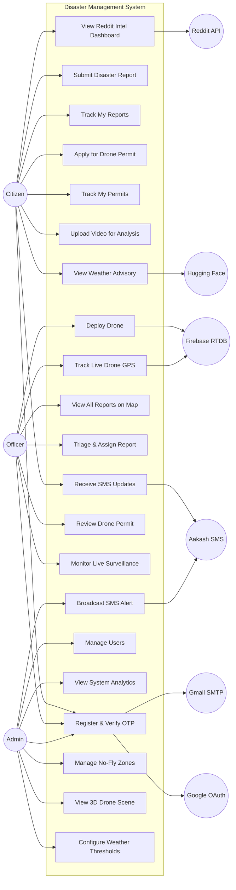

#### Role Inheritance

The arrows above show only each role's **distinctive** use cases. The full capability set is hierarchical:

- **Admin** can do everything an Officer can do, plus UC16–UC21.
- **Officer** can do everything a Citizen can do, plus UC10–UC15.
- **Citizen** has UC1–UC9.

This is enforced at the backend in [dependencies/auth.py](../app/api/v1/dependencies/auth.py) — `get_current_officer` accepts officer **or** admin tokens, and `get_current_citizen` accepts any authenticated user.

---

### 3.6.4.2 Use Case Description

This section provides a detailed textual description for each key use case. For each, we specify the actor, preconditions, main success scenario, alternate flows, postconditions, and the concrete endpoint(s) that implement it.

#### UC1 — Register & Verify OTP

- **Primary actor**: any human user (Citizen / Officer / Admin).
- **Preconditions**: user has a valid Google account; user has not previously registered with the same email.
- **Main success scenario**:
  1. User clicks "Sign in with Google" on [LoginProcess.jsx](../frontend/src/pages/LoginProcess.jsx).
  2. Google OAuth returns an ID token; SPA forwards to `POST /api/v1/auth/register`.
  3. Backend creates an unverified `User` row and generates a 6-digit OTP (hashed, 10-min expiry, max 3 attempts).
  4. [gmail_service.py](../app/services/gmail_service.py) emails the OTP to the user.
  5. User enters the OTP on [OTPVerification.jsx](../frontend/src/pages/OTPVerification.jsx); SPA calls `POST /api/v1/auth/verify-otp`.
  6. Backend marks `is_verified=True`, issues a JWT, and sets an `httponly` `session_id` cookie.
  7. User is redirected to their role-specific dashboard.
- **Alternate flows**:
  - (A1) Officer registration: user must enter an organization code (NDRF2024 / FIRE-DEPT-2024 / POLICE-2024). Invalid code → HTTP 400.
  - (A2) Admin registration: user must enter `MASTER_ADMIN_CODE`. Invalid code → HTTP 400.
  - (A3) OTP expired or wrong: user can request resend up to 5 times per hour.
- **Postconditions**: user exists in DB with verified status, role assigned, and active session.
- **Implementing endpoints**: `/api/v1/auth/register`, `/api/v1/auth/verify-otp`, `/api/v1/auth/resend-otp`.

#### UC2 — Submit Disaster Report

- **Primary actor**: Citizen (or any authenticated user).
- **Preconditions**: user is authenticated and has granted browser geolocation permission.
- **Main success scenario**:
  1. User opens [DisasterReport.jsx](../frontend/src/pages/DisasterReport.jsx); browser captures latitude, longitude, accuracy.
  2. User selects disaster type (fire / flood / earthquake / landslide / storm / other), severity (LOW / MEDIUM / HIGH / CRITICAL), writes 10–5000 char description.
  3. SPA calls `POST /api/v1/disaster-reports/reports` with validated payload.
  4. Backend inserts `DisasterReport` with `status=PENDING` and returns report ID.
  5. User optionally uploads photos/videos via `POST /api/v1/disaster-reports/reports/{id}/media`.
  6. Backend broadcasts `ws_manager.notify("reports", "new_report")`; all officer Command Centers receive the hint and re-fetch markers.
- **Alternate flows**:
  - (A1) File exceeds size limit (images > 10 MB, videos > 50 MB): HTTP 400 with clear error.
  - (A2) Lat/long out of bounds: Pydantic rejects the payload before DB insert.
- **Postconditions**: report is visible in [MyDisasterReports.jsx](../frontend/src/pages/MyDisasterReports.jsx) and on every officer's [CommandCenter.jsx](../frontend/src/pages/CommandCenter.jsx) map.

#### UC4 — Apply for Drone Permit

- **Primary actor**: Citizen.
- **Preconditions**: user is authenticated; user has gathered the four required documents (purpose letter PDF, purchase bill PDF, drone image, citizenship PDF).
- **Main success scenario**:
  1. User opens [DronePermitForm.jsx](../frontend/src/pages/DronePermitForm.jsx) and completes the multi-section form: drone specs, operator identity, Nepal address hierarchy, document uploads.
  2. User checks `agrees_to_rules` and submits.
  3. SPA calls `POST /api/v1/permits/submit` as multipart.
  4. Backend stores files under `uploads/permits/{user_id}/` and inserts `DronePermit` with `status=PENDING`.
  5. Permit appears in [MyPermits.jsx](../frontend/src/pages/MyPermits.jsx) and in every officer's pending queue.
- **Alternate flows**:
  - (A1) Missing required field or file: HTTP 400.
- **Postconditions**: permit awaits officer review.

#### UC11 — Triage & Assign Report

- **Primary actor**: Officer.
- **Preconditions**: officer is authenticated; at least one `DisasterReport` exists.
- **Main success scenario**:
  1. Officer opens [CommandCenter.jsx](../frontend/src/pages/CommandCenter.jsx) and sees severity-colored radar-pulse markers on the Leaflet map of Nepal.
  2. Officer clicks a marker; map flies to target; detail panel opens.
  3. Officer calls `PATCH /api/v1/disaster-reports/reports/{id}` with `status=REVIEWING`, `assigned_officer_id=self`, optional `officer_notes`.
  4. Backend appends a `DisasterReportStatusHistory` row, fires a background-thread SMS to the reporter via Aakash, and broadcasts `ws_manager.notify("reports", "status_updated")`.
  5. Officer can progress the report through `DISPATCHED → RESCUING → RESOLVED` (or `REJECTED` at any stage), each transition repeating steps 3–4.
- **Alternate flows**:
  - (A1) Invalid status transition: Pydantic + DB `CheckConstraint` reject.
- **Postconditions**: report state advances; audit trail grows by one row; citizen receives SMS.

#### UC12 — Deploy Drone

- **Primary actor**: Officer.
- **Preconditions**: an active disaster report exists; no-fly-zone check passes; weather advisory is consulted.
- **Main success scenario**:
  1. From the report detail panel, officer triggers deploy; backend creates a `DroneDeployment` row with `mission_status=DEPLOYED`.
  2. Drone field device begins writing GPS to Firebase Realtime Database under node keyed by `drone_id`.
  3. Officer's map subscribes directly to Firebase and renders the drone's live position.
  4. Backend sync job reads Firebase periodically and writes `last_known_latitude`, `last_known_longitude`, `last_sync_at` into Postgres for durability.
  5. Officer progresses `mission_status`: `EN_ROUTE → ON_SITE → RETURNING → COMPLETED`, recording `arrived_at`, `completed_at`, `distance_traveled`, `flight_duration`.
- **Alternate flows**:
  - (A1) Mission aborted: `mission_status=ABORTED`.
- **Postconditions**: `DroneDeployment` row is complete with metrics; citizen report typically transitions to `RESOLVED` in parallel.

#### UC13 — Review Drone Permit

- **Primary actor**: Officer (or Admin).
- **Preconditions**: one or more permits exist with `status=PENDING`.
- **Main success scenario**:
  1. Officer opens [PermitReview.jsx](../frontend/src/pages/PermitReview.jsx) → `GET /api/v1/permits/pending`.
  2. Officer optionally downloads document ZIP bundle via `GET /api/v1/permits/download/{id}`.
  3. Officer calls `POST /api/v1/permits/review` with decision (`APPROVED` / `REJECTED`) and remarks.
  4. Backend persists `reviewed_by_officer_id`, `officer_name`, `officer_designation`, `officer_organization`, `officer_email`, `review_remarks`, `reviewed_at`.
- **Alternate flows**:
  - (A1) Permit already reviewed: HTTP 400 — review is one-shot.
- **Postconditions**: permit is `APPROVED` or `REJECTED`; citizen sees final decision in [MyPermits.jsx](../frontend/src/pages/MyPermits.jsx).

#### UC14 — Monitor Live Surveillance

- **Primary actor**: Officer.
- **Preconditions**: an IP-camera URL is configured, or webcam is available.
- **Main success scenario**:
  1. Officer opens [LiveSurveillance.jsx](../frontend/src/pages/LiveSurveillance.jsx).
  2. Client connects to `WS /api/v1/realtime/detect?token=<jwt>&ip_cam_url=<rtsp>&confidence=0.45`.
  3. Server opens OpenCV stream with `CAP_PROP_BUFFERSIZE=1`, iterates frames, runs YOLOv8 inference, sends alternating JSON metadata + binary JPEG at ~15 FPS.
  4. Client renders annotated video inline with detection overlays.
- **Alternate flows**:
  - (A1) Camera disconnect: server auto-reconnects.

#### UC16 — Manage Users

- **Primary actor**: Admin.
- **Main success scenario**:
  1. Admin opens [UserManagement.jsx](../frontend/src/pages/UserManagement.jsx) → `GET /api/v1/users/all` (filter by role / search / is_active).
  2. Admin can soft-delete (`DELETE /api/v1/users/delete/{id}`), edit (`PUT /api/v1/users/admin/update/{id}`), or reactivate (`PUT /api/v1/users/admin/activate/{id}`).
- **Alternate flows**:
  - (A1) Admin tries to deactivate self: blocked with HTTP 400.
  - (A2) Admin tries to change own role: blocked (lockout prevention).

#### UC18 — Broadcast SMS Alert

- **Primary actor**: Admin.
- **Main success scenario**:
  1. Admin composes a message on [DisasterAlertSMS.jsx](../frontend/src/pages/DisasterAlertSMS.jsx) (≤500 chars).
  2. Admin previews recipients via `GET /api/v1/sms/citizens-with-phone` (all active citizens with a phone number).
  3. Admin calls `POST /api/v1/sms/broadcast`; backend iterates recipients, normalizes each phone (strip `+977`/`977`, enforce 10-digit), and calls Aakash SMS v3 per recipient.
  4. Response returns `{total, sent, failed, results[]}`.

---

### 3.6.4.3 Class Diagram

The class diagram captures the static structure of the persisted domain. Classes correspond to SQLAlchemy ORM models under [app/models/](../app/models/); attributes correspond to mapped columns; associations correspond to foreign keys. Eleven tables span four domain groups: **Auth/User**, **Disaster Reporting**, **Permits**, and **Intelligence**.

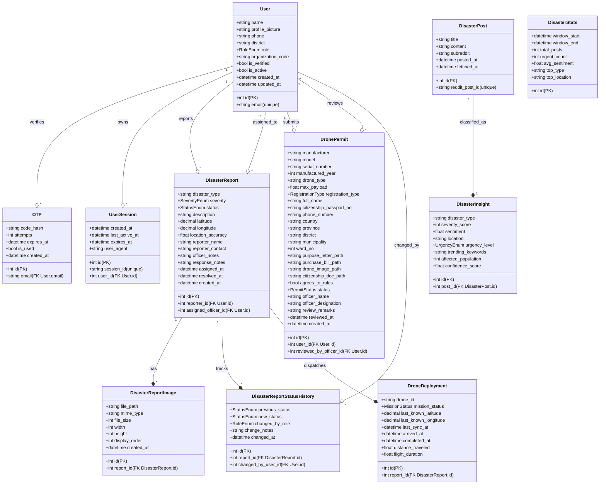

#### Enumerations

- **`RoleEnum`**: `CITIZEN`, `OFFICER`, `ADMIN` (hierarchical: admin inherits officer; officer inherits citizen).
- **`SeverityEnum`**: `LOW`, `MEDIUM`, `HIGH`, `CRITICAL` — drives marker color in the Command Center.
- **`StatusEnum`**: `PENDING`, `REVIEWING`, `DISPATCHED`, `RESCUING`, `RESOLVED`, `REJECTED`.
- **`MissionStatus`**: `DEPLOYED`, `EN_ROUTE`, `ON_SITE`, `RETURNING`, `COMPLETED`, `ABORTED`.
- **`PermitStatus`**: `PENDING`, `APPROVED`, `REJECTED` — one-shot terminal.
- **`RegistrationType`**: `INDIVIDUAL`, `COMPANY`.
- **`UrgencyEnum`**: `LOW`, `MEDIUM`, `HIGH`, `CRITICAL`.

All enumerations are enforced both at the application layer (Pydantic schemas under [app/schemas/](../app/schemas/)) and at the storage layer via SQLAlchemy `CheckConstraint`s, so any attempt to persist an invalid value raises an error at commit time.

#### Key Integrity Rules

- **Cascade delete**: removing a `DisasterReport` cascades to its images, status history, and deployments.
- **Immutable audit**: `DisasterReportStatusHistory` is append-only — no update or delete allowed.
- **One-shot review**: once `PermitStatus` is `APPROVED` or `REJECTED`, `POST /permits/review` returns HTTP 400 on re-submission.
- **Self-lockout prevention**: admin cannot change own `role` or set own `is_active=False`.

---

### 3.6.4.4 Sequence Diagram

Sequence diagrams trace the time-ordered interactions between objects during a specific scenario. Three critical workflows are shown below.

#### SD1 — Registration and OTP Verification

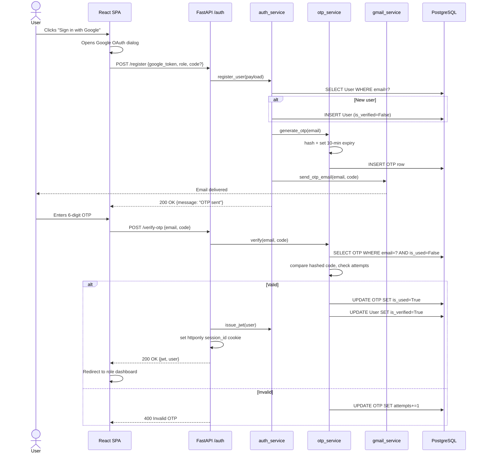

#### SD2 — Disaster Report Submission and Officer Triage

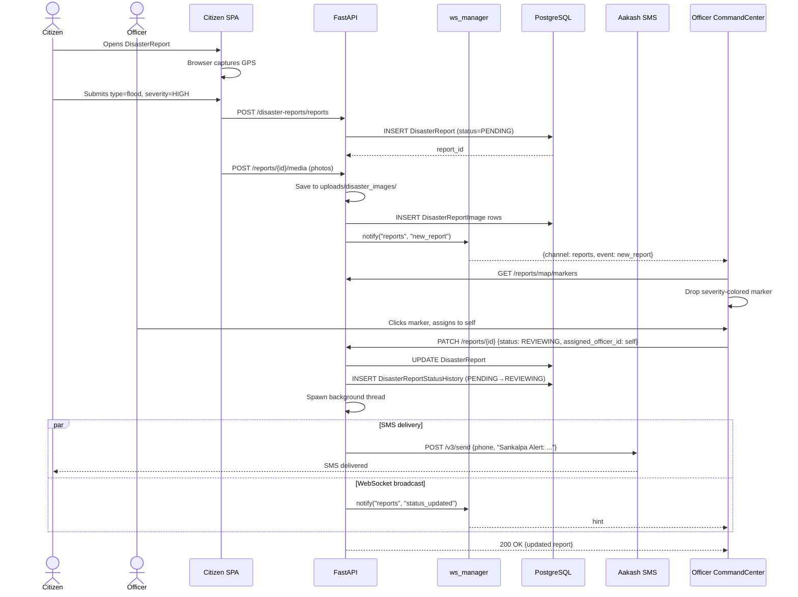

#### SD3 — Drone Deployment with Firebase Telemetry

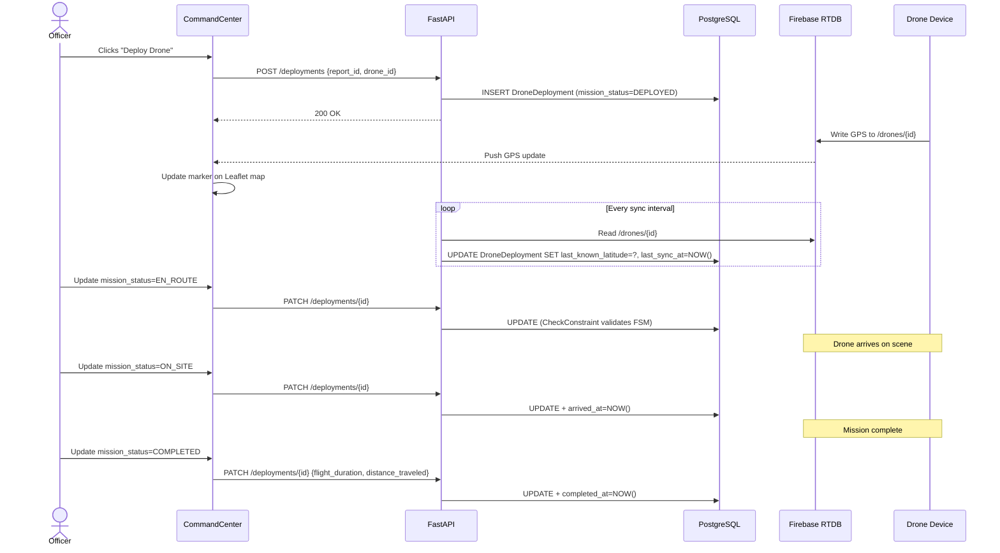

---

### 3.6.4.5 Activity Diagram

Activity diagrams show control flow through a workflow, including decisions, parallel actions, and merge points. Two core workflows are shown.

#### AD1 — End-to-End Incident Lifecycle

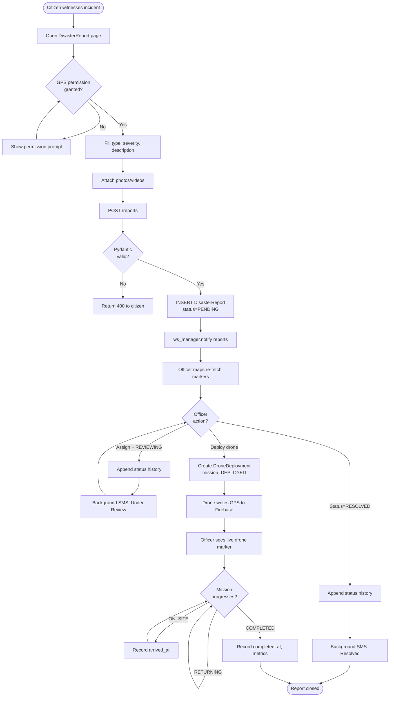

#### AD2 — Video Analysis Pipeline

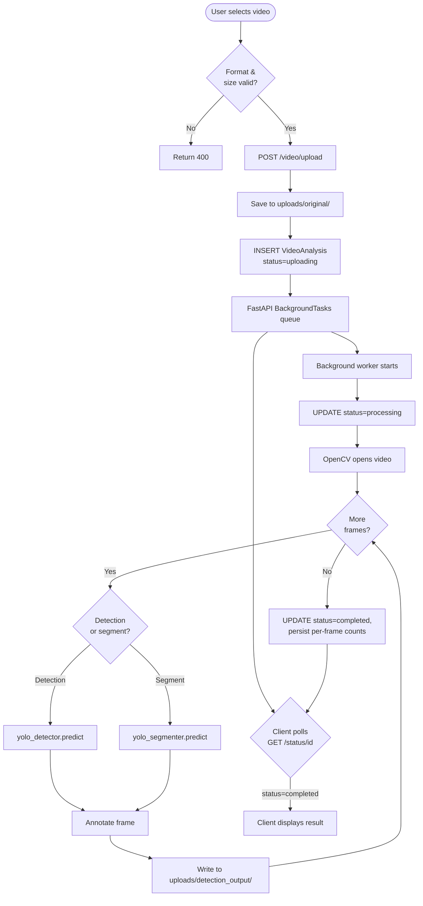

---

### 3.6.4.6 Collaboration Diagram

A collaboration (communication) diagram emphasizes the structural relationships between objects that cooperate in a scenario, with numbered messages showing the interaction order. Two collaborations are shown below.

#### CD1 — Report Status Change Propagation

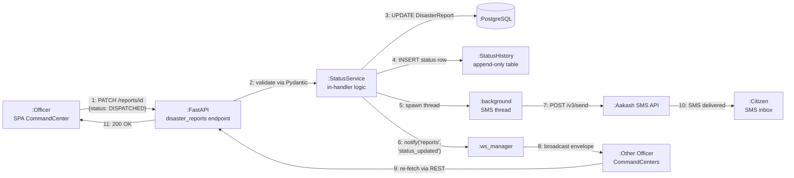

#### CD2 — Registration and OTP Verification Collaboration

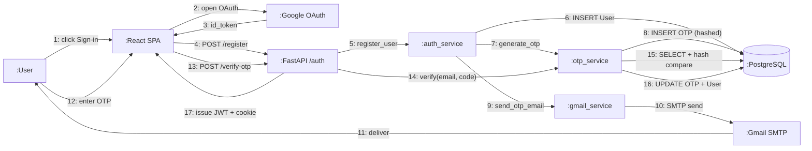

---

### 3.6.4.7 State / Workflow Diagrams

The platform contains three domain entities whose lifecycles are strictly governed by finite state machines (FSMs). Each transition is guarded by application-level validation and enforced at the storage layer through SQLAlchemy `CheckConstraint`s, so invalid transitions are rejected both before and at commit.

#### SM1 — Disaster Report Status Lifecycle

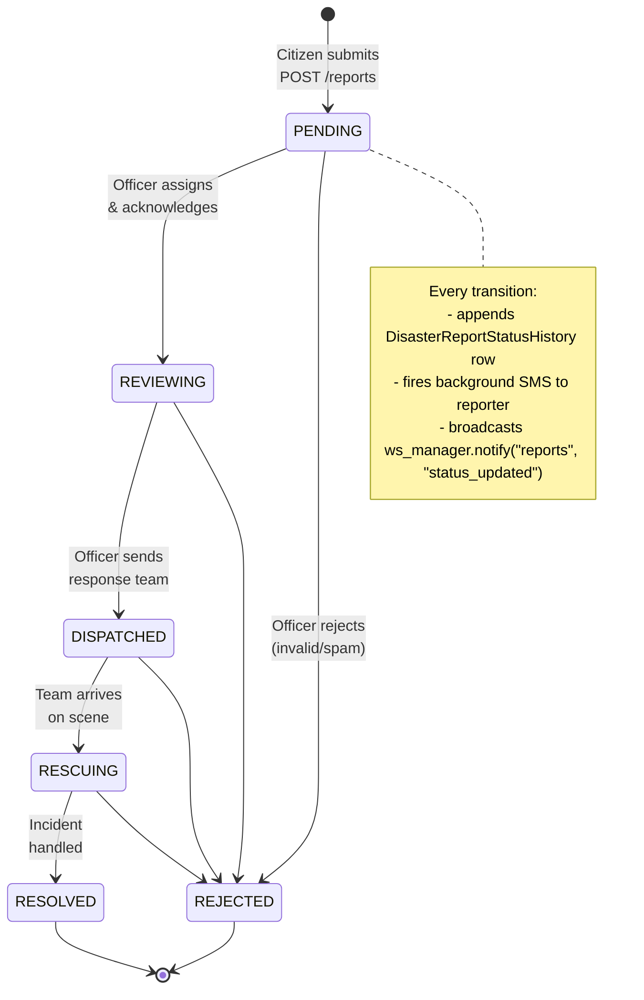

**Transition guards**:
- Only an authenticated Officer or Admin can advance the status (enforced by `Depends(get_current_officer)`).
- Every transition must record `changed_by_user_id` and `changed_by_role` in the history table.
- `REJECTED` is reachable from any non-terminal state; `RESOLVED` is only reachable from `RESCUING`.

#### SM2 — Drone Mission Lifecycle

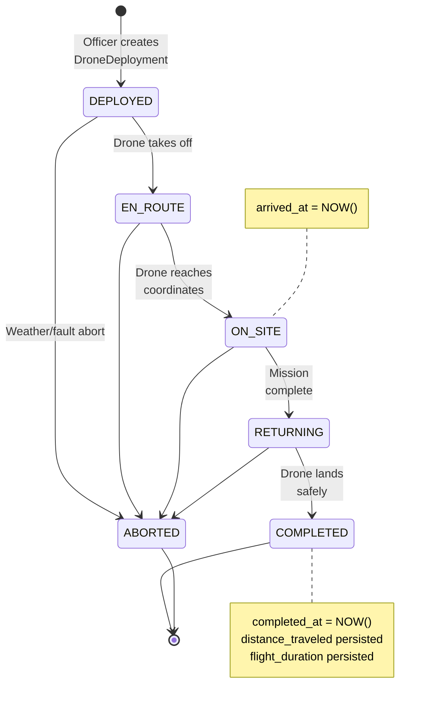

**Storage enforcement**: [app/models/disaster_reports.py:152-157](../app/models/disaster_reports.py#L152-L157) declares a `CheckConstraint` that allows only the six enum values above — any stray string (including lowercase variants or typos) is rejected at commit time, not just at the app layer.

#### SM3 — Drone Permit Review Lifecycle

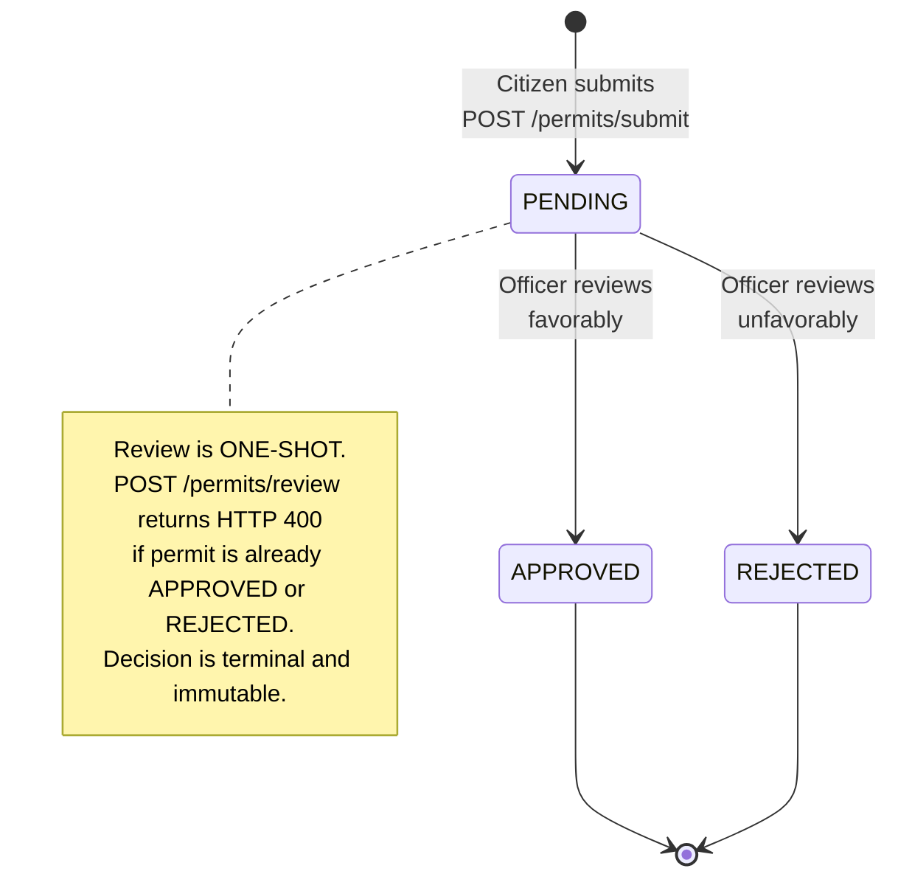

**Why one-shot**: drone permits are legally accountable. Allowing a permit to oscillate between states would destroy the audit trail and create ambiguity about which decision was authoritative. The `POST /api/v1/permits/review` endpoint checks the current status and raises HTTP 400 with message "Permit has already been reviewed" if it is not `PENDING`.

#### SM4 — Video Analysis Processing Lifecycle

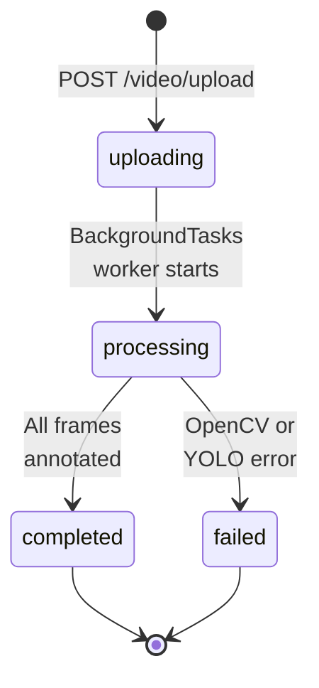

This is a simpler linear FSM owned by [video_processor.py](../app/services/video_processor.py). The client polls `GET /api/v1/video/status/{id}` to observe state; no WebSocket is used because the state changes on the order of seconds to minutes, not milliseconds.

#### SM5 — Authentication / Session Lifecycle

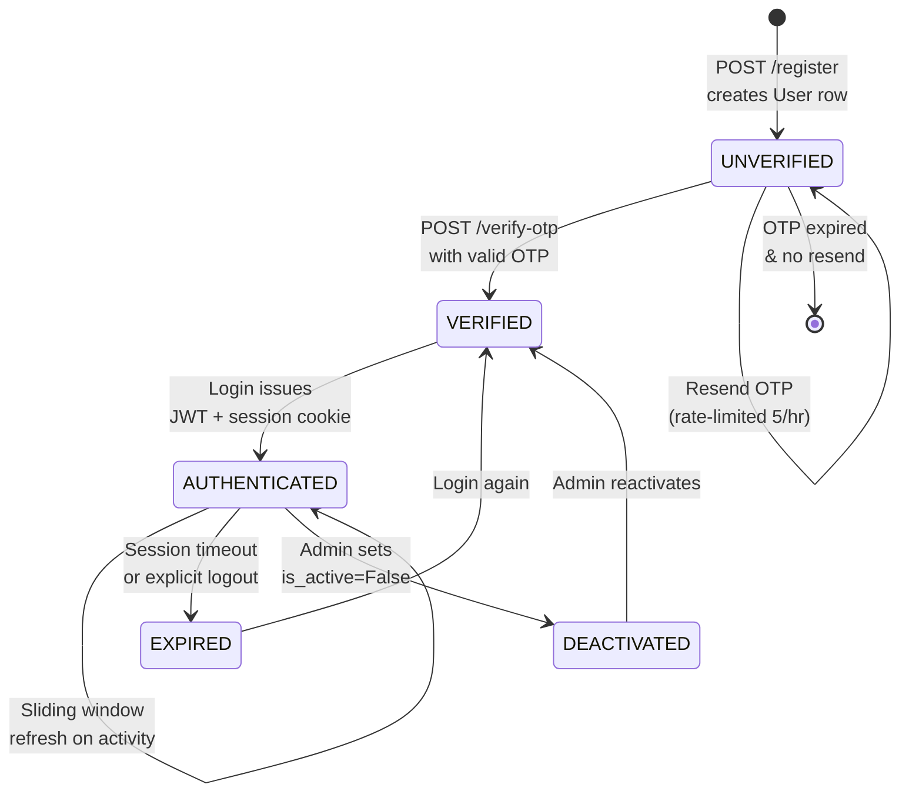

The sliding-window refresh is implemented in [session_service.py](../app/services/session_service.py): every authenticated request updates `UserSession.last_active_at` so the cookie remains valid as long as the user is active. An explicit logout calls `destroy_all_user_sessions()`, which wipes every active session row for that user across devices.

---

## Summary

The seven diagram categories together give a complete view of the system:

| Diagram | Perspective | Primary artifact |
|---|---|---|
| Use Case | **Who** does **what** | Actor → use case bindings |
| Use Case Description | Detailed intent & flow of each use case | Preconditions, main & alternate flows, postconditions |
| Class | **Static structure** of persisted domain | ORM classes, attributes, associations, enums |
| Sequence | **Time-ordered** interaction for a scenario | Object lifelines, messages, alt/par blocks |
| Activity | **Control flow** of a workflow | Decisions, parallel actions, merges |
| Collaboration | **Object relationships** + numbered messages | Topology of cooperation |
| State / Workflow | **Lifecycle** of entities with FSM | States, guarded transitions, enforcement layer |

Every element in every diagram maps to a concrete, verifiable artifact in the codebase — a model file, a route handler, a service module, or a `CheckConstraint` on a table. The diagrams are therefore not an idealized specification but a current reflection of how the Disaster Management System actually behaves at runtime.
